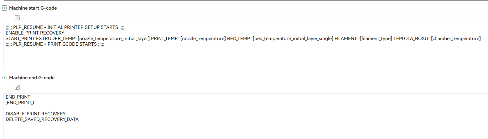

# PowerLossRecovery for any Klipper 3D printer

## Prerequisites
having already installed Klipper, Moonraker, and Mainsail (you can use Kiauh).

To install KlipperPowerLostRecovery for Klipper, follow these simple steps below:

## Installation
* Clone the Klipper_PLR Klipper repository from GitHub to your local machine:
    ```bash
    git clone https://github.com/yzeroy/Klipper_PLR.git
    cd Klipper_PLR
    ./install.sh
    ```

* add this into your slicer start-gcode :
    ```bash
    ;;;;; PLR_RESUME - INITIAL PRINTER SETUP STARTS ;;;;;
	ENABLE_PRINT_RECOVERY
	
	YOUR EXISTING PRINT START MACROS OR COMMANDS 
	
	;;;;; PLR_RESUME - PRINT GCODE STARTS ;;;;;
	
    ```

<p align="center">
  
</p>

* end-gcode add in your slicer:
    ```bash
	YOUR EXISTING PRINT END MACROS OR COMMANDS
	
	DISABLE_PRINT_RECOVERY
    DELETE_SAVED_RECOVERY_DATA
	
    ```
* To resume printing after a power cut or emergency stop, simply execute the 'RESUME_PRINT' macro in the UI (Mainsail or Fluidd) console or via the Macro button on the UI dashboard.

 


